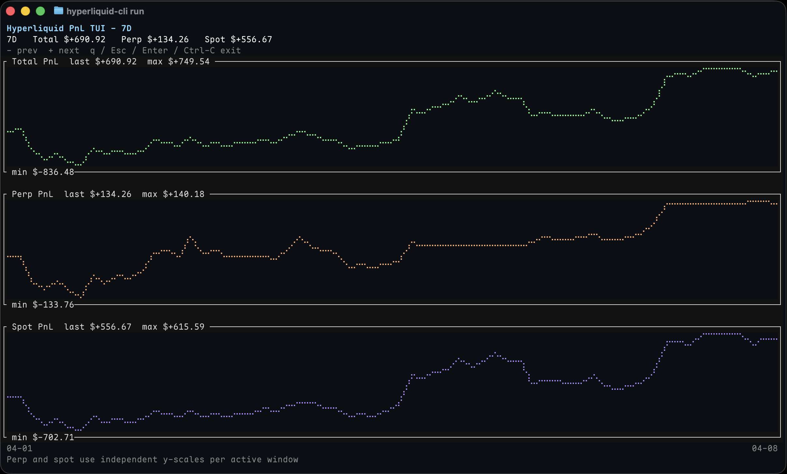

# Hyperliquid CLI

[](https://github.com/zydtiger/hyperliquid-cli)
[](https://python.org)
[](LICENSE)
[](https://github.com/zydtiger/hyperliquid-cli/actions)
[](https://github.com/zydtiger/hyperliquid-cli/actions/workflows/ci.yml)

A comprehensive Hyperliquid trading system with both CLI and REST API interfaces. Execute smart orders, monitor positions, and manage your trading workflow with ease.



## Quick Start

### Installation

Requires Python 3.11 or newer.

```bash
# Clone the repository
git clone https://github.com/zydtiger/hyperliquid-cli.git
cd hyperliquid-cli

# Create virtual environment and install in development mode
uv venv
uv pip install -e .

# Activate the virtual environment
source .venv/bin/activate
```

### Setup Configuration

```bash
# Create a default configuration file (saved to ~/.hyperliquid-cli/config.yaml)
hyperliquid-cli create-config

# Edit the generated config.yaml with your credentials
# Add your Hyperliquid API credentials and trading preferences
```

### Start Using

```bash
# Launch the interactive CLI
hyperliquid-cli run

# Or start the backend API server
hyperliquid-backend

# The backend will be available at http://localhost:8080
```

### Interactive CLI Commands

Once you start `hyperliquid-cli run`, you'll enter an interactive session with these available commands:

```
hyperliquid> order              # Launch order creation wizard
hyperliquid> positions          # Show open positions
hyperliquid> balances           # Display account balances
hyperliquid> watch BTC          # Launch the live watch TUI for BTC perps
hyperliquid> open_orders        # List all open orders
hyperliquid> cancel_order all   # Cancel all open orders
hyperliquid> order_status 12345 # Get specific order details
hyperliquid> modify_order 12345 # Modify existing order
hyperliquid> status             # Show account status
hyperliquid> help               # Show available commands
hyperliquid> quit               # Exit the CLI
```

## Features

### 🖥️ CLI Interface (`hyperliquid-cli`)

- **Interactive Trading Wizards**: Step-by-step order creation with validation
- **Real-time Market Data**: Access current prices, funding rates, and market depth
- **Live Watch TUI**: Monitor mark price, open interest, and the top of book in one screen
- **Portfolio Management**: Monitor positions, balances, and PnL
- **Order Operations**: Create, modify, cancel, and track orders
- **Smart Prompts**: Context-aware input with tab completion

### 🌐 Backend API (`hyperliquid-backend`)

FastAPI-based REST server providing comprehensive trading endpoints:

**Market Data:**

- `GET /available_coins` - List all tradable assets
- `GET /ticker/{coin}` - Real-time price and funding data
- `GET /watch/{coin}` - Live mark price history and order book snapshot for perps
- `GET /metadata/{coin}` - Trading specifications

**Order Management:**

- `POST /market_order` - Execute market orders
- `POST /limit_order` - Place limit orders with TIF options
- `POST /modify_order` - Modify existing limit orders
- `POST /cancel_order` - Cancel single or all orders

**Portfolio Operations:**

- `GET /positions` - All open positions
- `GET /balances` - Comprehensive balance information
- `GET /order_status/{id}` - Detailed order information

## Configuration

The configuration file is automatically created at `~/.hyperliquid-cli/config.yaml` when you run `hyperliquid-cli create-config`.

You can also specify a custom configuration path using the `--config` option:

```bash
hyperliquid-cli --config /path/to/custom/config.yaml run
```

Here's the configuration structure:

```yaml
hyperliquid:
  account_address: "your_ethereum_address"
  private_key: "your_private_key"
  network: "mainnet" # or "testnet"

trading:
  default_slippage: 0.005
  default_time_in_force: "GTC"

backend:
  host: "localhost"
  port: 8080
  logging:
    level: "INFO"
```

## Installation Requirements

- **Python**: 3.11 or higher
- **Dependencies**: Automatically installed with the package
- **Hyperliquid Account**: API credentials from the exchange

## Development Setup

```bash
# Clone the repository
git clone https://github.com/zydtiger/hyperliquid-cli.git
cd hyperliquid-cli

# Set up development environment
uv sync --dev
uv run pre-commit install

# Run tests
uv run pytest -v .

# Format code
uv run ruff format .

# Type checking
uv run mypy src
```

## Project Structure

```
hyperliquid-cli/
├── src/
│   ├── backend/         # FastAPI REST API server
│   ├── cli/             # Command-line interface
│   └── models/          # Data models and types
├── tests/               # Comprehensive test suite
├── docs/                # Documentation
└── config.example.yaml  # Configuration template
```

## API Documentation

When running `hyperliquid-backend`, visit:

- **Swagger UI**: `http://localhost:8080/docs`
- **ReDoc**: `http://localhost:8080/redoc`

## Security

- Private keys are encrypted in configuration
- API communication uses HTTPS
- No sensitive data is logged
- Supports testnet for safe testing

## License

GNU Affero General Public License v3.0 - see [LICENSE](LICENSE) for details.

## Contributing

1. Fork the repository
2. Create a feature branch
3. Make your changes
4. Run tests: `pytest -v .`
5. Install hooks once: `uv run pre-commit install`
6. Hooks run `uv run ruff check --fix` and `uv run ruff format` on staged Python files at commit time
7. Submit a pull request

## Support

- **Issues**: [GitHub Issues](https://github.com/zydtiger/hyperliquid-cli/issues)
- **Documentation**: [Project Wiki](https://github.com/zydtiger/hyperliquid-cli/wiki)
- **Hyperliquid**: [Official Docs](https://hyperliquid.xyz/)
